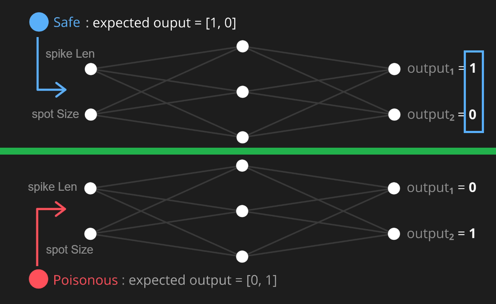

# How AI works ? How NEURAL NETWORKS works

**the neural networks tutorial for dummies**

this project is about to demonstrate how neural networks work.

## pages / lessions

[Page 1 Link](https://bresleveloper.github.io/Neural-Network-Tutorial-for-Dummies/html/01_rotation_weights.html) - **the 1st page**  is about just showing a "map" of items that needs cognitive decision for categorizing, most basic Neural Network with only inputs and outputs

[Page 2 Link](https://bresleveloper.github.io/Neural-Network-Tutorial-for-Dummies/html/02_bias.html) - **the 2nd page** is about improving the Neural Network by adding bias, enabling to extend the categorizing decision.

[Page 3 Link](https://bresleveloper.github.io/Neural-Network-Tutorial-for-Dummies/html/03_hidden_layer.html) - **the 3rd page** is about improving the Neural Network by adding hidden layer so we can make non-linear decisions.

[Page 4 Link](https://bresleveloper.github.io/Neural-Network-Tutorial-for-Dummies/html/04_learn_alone.html) - **the 4th page** is about letting Neural Network learn alone

## coding?

just used claude code, prompts are in the `t` folder (stands for tasks). sure there were some adjustments but those were working 1st time.

## challenge

the challenge in defined by having a fruid with spots and spikes, and according to their values we decide if its good or poisonous

